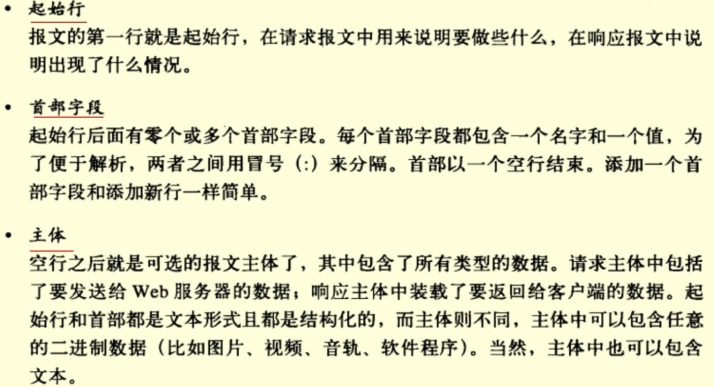
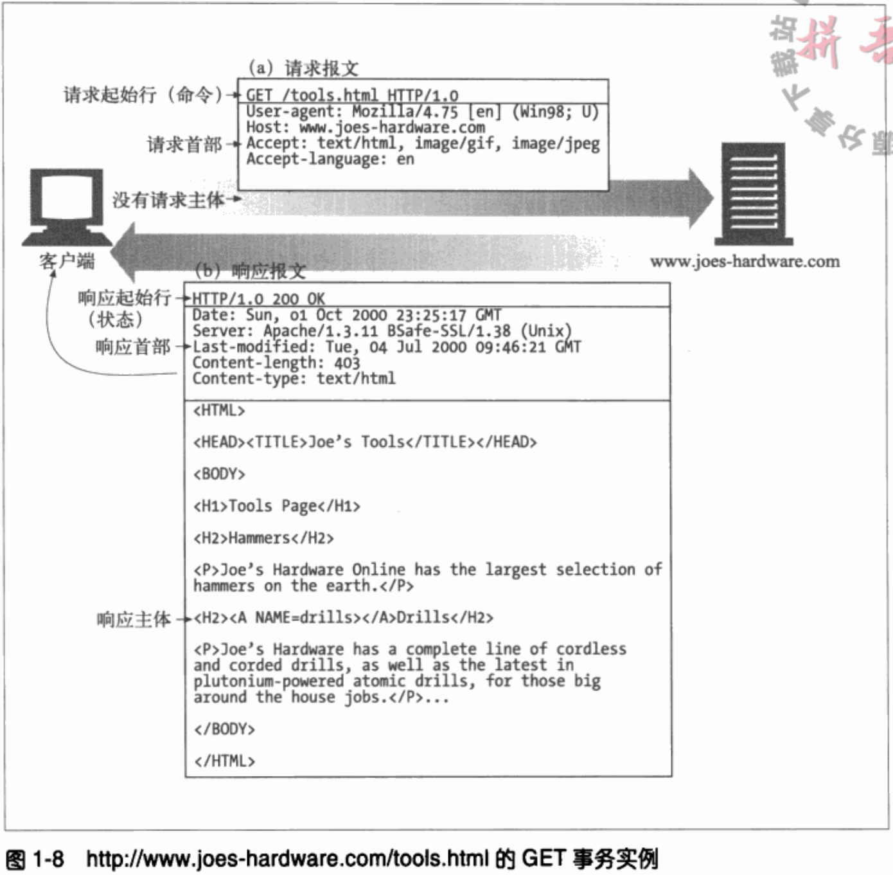
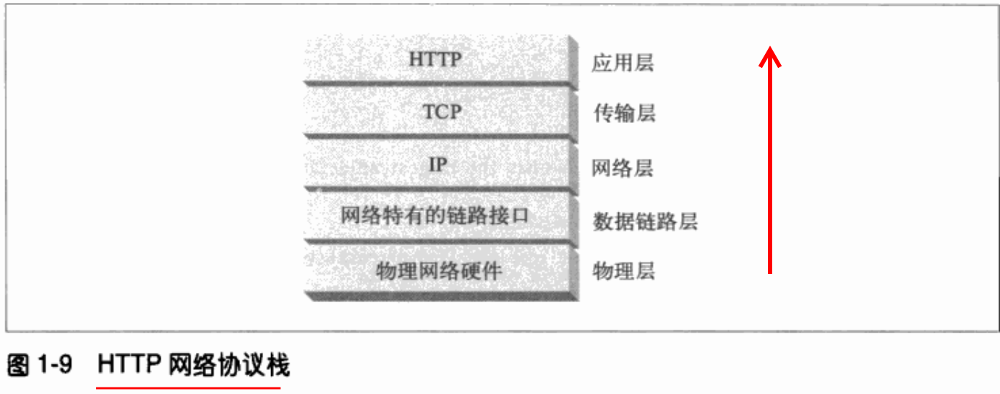
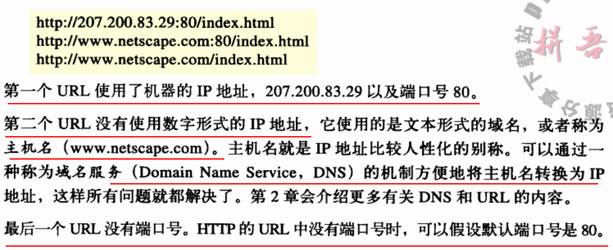
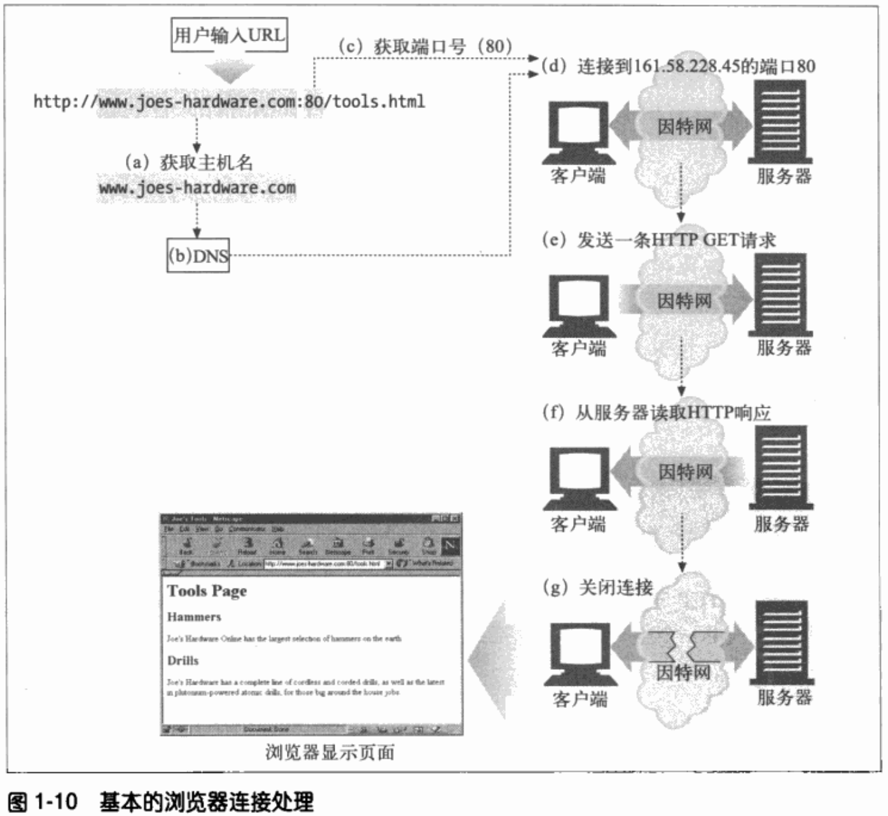

This is a summary file for book  《HTTP权威指南》
=============

## 1 HTTP概述
### 1.2 Web客户端和服务器
*   Web内容都是存储在Web服务器上的。Web服务器所使用的是HTTP协议，因此经常会被成为HTTP服务器
### 1.3 资源
*   Web服务器是Web资源（Web resource）的宿主
#### 1.3.1 媒体类型
> 因特网上有数千种不同的数据类型，HTTP仔细地给每种要通过Web传输的对象都打上了名为MIME类型（MIME type）的数据格式标签
> MIME类型是一种文本标记，表示一种主要的对象类型和一个特定的子类型，中间由一条斜杠来分割
> > 1. HTML格式的文本文档由text/html类型来标记;
> > 2. 普通的ASCII文本文档由text/plain类型来标记;
> > 3. JPEG版本的图片未image/jpeg类型;
> > 4. Gif版本的图片未image/gif类型;
> > 5. Apple的QuickTime电影为video/quicktime类型;
> > 6. 微软的PowerPoint演示文件为apllication/vnd.ms-powerpoint;
#### 1.3.2 URI
*   服务器资源名称被称为统一资源标识符（Uniform Resource Identifier，URI）
*   URI有两种形式
>   URL：资源标识符最常见的形式
> > * URL的第一部分被称为方案（scheme），说明了访问资源所使用的协议类型。这部分通常就是HTTP协议（http://）
> > * 第二部分给出了服务器的因特网地址（比如，www.joes-hardware.com）
> > * 其余部分指定了Web服务器上的某个资源（比如，/specials/saw-blade.gif）
>   URN：统一资源名
### 1.4.1 方法
*   HTTP支持几种不同的请求命令，这些命令被称为HTTP方法（HTTP method）
**一些常用的HTTP方法**

HTTP方法 | 方法
---- | ------
GET | 从服务器向客户端发送命名资源
PUT | 将来自客户端的数据存储到一个命名的服务器资源中去
DELETE | 从服务器中删除命名资源
POST | 将客户端数据发送到一个服务器网关应用程序
HEAD | 仅发送命名资源响应中的HTTP首部

#### 1.4.2 状态码
*   每条HTTP响应报文返回时都会携带一个状态码
**一些常见的HTTP状态码**

HTTP状态码 | 描述
---- | ------
200 | OK。文档正确返回
302 | Redirect（重定向）。到其他地方去获取资源
404 | NOt Found（没找到）。无法找到这个资源

*   伴随着每个数字状态码，HTTP还会发送一条解释性的 “原因短语” 文本
### 1.5 报文
*   HTTP报文都是纯文本，不是二进制代码，所以人们可以很方便地对齐进行读写。
>   从Web客户端发往Web服务器的HTTP报文称为请求报文（request message）
>   从服务器发往客户端的报文称为响应报文（response message）  

### 1.6 连接
*   报文是如何通过传输控制协议（Transmission Control Protocol，TCP）连接从一个地方搬移到另一个地方去的
#### 1.6.1 TCP/IP
*   HTTP是个应用层协议。HTTP无需操心网络通信的具体细节；它把联网的细节都交给了通用、可靠的因特网传输协议TCP/IP
> TCP
> > 无差错的数据传输
> > 按序传输（数据总是会按照发送的顺序到达）
> > 未分段的数据流（可以在任意时刻以任意尺寸将数据发送出去）
*   只要建立了TCP连接，客户端和服务器直接的报文交换就不会丢失、不会被破坏，也不会再接收时出现**错序**

#### 1.6.2 连接、IP地址及端口号
*   在HTTP客户端向服务器发送报文之前，需要用网际协议（Internet Protocol，IP）地址和端口号在客户端和服务器直接建立一条TCP/IP连接

*   连接步骤如下：

（a）浏览器从URL中解析出服务器的主机名；
（b）浏览器将服务器的主机名转换成服务器的IP地址；
（c）浏览器将端口号（如果有的话）从URL中解析出来；
（d）浏览器建立一条与服务器的TCP连接；
（e）浏览器向服务器发送一条HTTP请求报文；
（f）服务器向浏览器会送一条HTTP响应报文；
（g）关闭连接，浏览器显示文档；

### 1.7 协议版本
*   HTTP/0.9
*   HTTP/1.0
*   HTTP/1.0+
*   __HTTP/1.1__(目前常用的)
*   HTTP-NG

### 1.8 Web的结构组件
*   代理
    位于客户端和服务器之间的HTTP中间实体
*   缓存
    HTTP的仓库，使常用页面的副本可以保存在离客户端更近的地方
*   网关
    连接其他应用程序的特殊Web服务器
*   隧道
    对HTTP通信报文进行盲转发的特殊代理
*   Agent代理
    发起自动HTTP请求的半智能Web客户端
